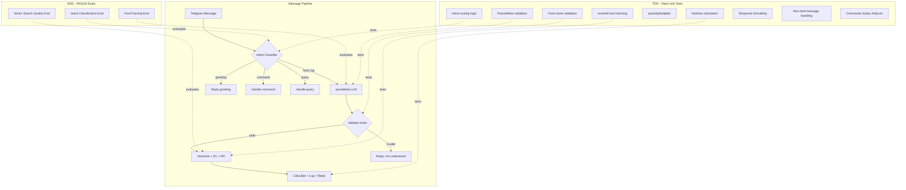

# TDD + EDD Nutrition Tracker Build Plan

## The Problem (Motivating Example)

User sends "hi" and the bot logs: "Snack logged: 200 kcal, 10g protein / 1 hi: 200 kcal (estimated)".

**Root cause chain in `[src/api/telegram/services.ts](src/api/telegram/services.ts)`:**

1. No intent classification -- every text message enters the food pipeline
2. `parseMeal("hi")` in `[src/lib/food/inputParser.ts](src/lib/food/inputParser.ts)` either returns `{foods: [{name: "hi"}]}` from LLM or the catch-all fallback (line 60-66) wraps the raw message as a food item
3. No match in Vectorize or R1, so it falls through to Nutritionix/FatSecret
4. API returns generic estimate (200 kcal) or fallback kicks in
5. Bot confidently logs nonsense to Google Sheets

## Architecture: Two Testing Strategies




---

## Phase 0: Testing Infrastructure

### 0a. Install RAGAS TypeScript + Eval Scaffolding

- `pnpm add -D @ragas-lib/core` for EDD
- Create `evals/` directory for RAGAS evaluation scripts
- Create `evals/datasets/` for ground truth JSON files
- Add `pnpm run eval` script to package.json
- The eval runner will use a `MockProvider` for CI and `GeminiProvider` for real evals (controlled by env var)

### 0b. Create Ground Truth Datasets

`**evals/datasets/intent-classification.json**` -- ~30 examples:

- Greetings: "hi", "hello", "hey", "good morning"
- Food logs: "2 eggs for breakfast", "had sambar and rice for lunch", "protein shake"
- Commands: "/start", "/help", "/today"
- Questions: "what did I eat today?", "how many calories?"
- Nonsense: "asdf", "123", "lol"

`**evals/datasets/food-parsing.json**` -- ~25 examples:

- Single food: "2 eggs for breakfast" -> `{meal_time: "breakfast", foods: [{name: "egg", quantity: 2, unit: "n"}]}`
- Multi food: "2 chapatis, protein shake, 1 cup sambar for breakfast"
- Implicit meal time: "had rice and dal" (afternoon -> lunch)
- Quantity variants: "half cup sambar", "a couple eggs", "100ml milk"
- Restaurant mentions: "ghee podi dosa from Saravana Bhavan for breakfast"

`**evals/datasets/vector-search.json**` -- ~15 examples:

- Exact: "egg" -> "Egg"
- Fuzzy: "chappati" -> "Chapati", "protien shake" -> "Protein Shake"
- No match: "ghee podi dosa" -> null

---

## Phase 1: Intent Guard (Fix the Hallucination)

This is the critical fix. We add an intent classification layer before the food pipeline.

### Step 1: Write failing EDD eval -- intent classification

Create `evals/intent-classification.eval.ts` using RAGAS with a custom metric that evaluates whether the LLM correctly classifies messages as `food_log`, `greeting`, `command`, `query`, or `other`. Uses the ground truth dataset. Should fail initially (no classifier exists).

### Step 2: Write failing TDD tests -- intent routing

Create `src/lib/intent/classify.test.ts`:

- Test that `classifyIntent("hi")` returns `{intent: "greeting"}` not `"food_log"`
- Test that `classifyIntent("2 eggs for breakfast")` returns `{intent: "food_log"}`
- Test that `classifyIntent("/start")` returns `{intent: "command"}`
- Test routing logic: greetings get friendly reply, food_log enters pipeline

### Step 3: Implement intent classifier

Create `src/lib/intent/classify.ts`:

- **Fast-path rules** (no LLM needed): commands (`/start`, `/help`), very short non-food strings
- **LLM classification**: Use `@cf/qwen/qwen3-30b-a3b-fp8` with a classification prompt
- Return: `{ intent: "food_log" | "greeting" | "command" | "query" | "other", confidence: number }`

### Step 4: Wire into pipeline

Update `[src/api/telegram/services.ts](src/api/telegram/services.ts)`:

- Call `classifyIntent()` before `parseMeal()`
- Only enter food pipeline if `intent === "food_log"`
- Handle other intents with appropriate responses

### Step 5: Write failing TDD tests -- food name validation

Create `src/lib/food/validate.test.ts`:

- `isPlausibleFood("hi")` -> false
- `isPlausibleFood("egg")` -> true
- `isPlausibleFood("asdfghjk")` -> false
- `isPlausibleFood("protein shake")` -> true

### Step 6: Implement food name validator

Create `src/lib/food/validate.ts`:

- Blocklist of common non-food words (greetings, filler, profanity)
- Minimum length check (single char is suspicious)
- Optional: quick Vectorize check (if similarity < 0.3, it's not a food)
- This is a second safety net after intent classification

### Step 7: Remove aggressive fallbacks in inputParser.ts

Update `[src/lib/food/inputParser.ts](src/lib/food/inputParser.ts)`:

- Lines 43, 60, 65: Instead of wrapping raw message as food, return `{ meal_time: "snack", foods: [] }` with empty foods
- Let the caller (services.ts) handle empty foods gracefully ("I didn't understand that, try: 2 eggs for breakfast")

---

## Phase 2: Hardened Food Parsing

### Step 1: Write failing EDD eval -- food parsing accuracy

Create `evals/food-parsing.eval.ts`:

- Use RAGAS faithfulness + custom metrics
- Evaluate: does `parseMeal("2 chapatis, protein shake, 1 cup sambar for breakfast")` extract all 3 foods with correct quantities?
- Evaluate: meal time inference accuracy
- Evaluate: quantity normalization ("a couple" -> 2, "half" -> 0.5)

### Step 2: Write failing TDD tests -- parsing validation

Extend tests in `src/lib/food/inputParser.test.ts`:

- Valid meal structure (has foods array, valid meal_time)
- Food names are reasonable strings (not empty, not the raw message repeated)
- Quantities are positive numbers
- Units are from allowed set

### Step 3: Improve parser prompt

Update the `SYSTEM_PROMPT` in `[src/lib/food/inputParser.ts](src/lib/food/inputParser.ts)`:

- Add explicit instruction: "If the message does not contain any food items, return `{meal_time: 'snack', foods: []}`"
- Add few-shot examples in the prompt (especially non-food examples)
- Add: "Never invent food items that the user did not mention"

### Step 4: Add ParsedMeal validation layer

Create `src/lib/food/parsedMealValidator.ts`:

- Validate the LLM output schema strictly
- Check food names against basic heuristics
- Return validated result or empty foods

---

## Phase 3: Vector Search Quality

### Step 1: Write EDD eval -- vector search precision

Create `evals/vector-search.eval.ts`:

- For known foods (from R1), does Vectorize return the right match?
- For misspellings, does fuzzy matching work?
- For non-foods, does it correctly return no match (below 0.85)?
- This evaluates the embedding model + threshold combination

### Step 2: TDD tests for search result handling

Extend `src/lib/food/vectorize.test.ts` (with mocked Vectorize):

- Score above threshold -> return food
- Score below threshold -> return null
- Multiple matches -> pick highest score
- Missing metadata -> handle gracefully

---

## Phase 4: Remaining PRD Features (TDD)

Each feature follows red-green-refactor. Write failing tests first, then implement.

### 4a. Bot Commands

- `/start` -- already works
- `/help` -- show usage
- `/today` -- query today's tracker rows, format summary
- Test: command parsing, response format

### 4b. Non-food Response Handling

- Greetings -> "Hey! Send me what you ate to log it."
- Questions -> "Use /today to see your meals."
- Unknown -> "I track nutrition. Try: 2 eggs for breakfast"

### 4c. Response Formatting

- Format confirmation messages per PRD spec
- Show "(estimated)" for API-sourced foods
- Show per-item breakdown with calories

### 4d. Google Sheets Monthly Archiving

- `ensureMonthlySheet()` creates `YYYY-MM_Tracker` if missing
- Test date boundary: Jan 31 -> Feb 1 triggers new sheet
- Header row auto-creation

### 4e. Daily Totals

- After logging, calculate running total for the day
- Insert/update TOTAL row in tracker sheet

### 4f. Multi-Entry Same Meal (Phase 2 PRD)

- "also had oats for breakfast" appends to existing breakfast
- Detect continuation markers ("also", "and also", "plus")
- Update totals

---

## Phase 5: End-to-End Eval Pipeline

### Automated Eval Runner

- `pnpm run eval` runs all RAGAS evals against the live LLM
- `pnpm run eval:ci` runs with MockProvider for CI
- Output: JSON report with scores per metric
- Threshold: fail CI if any metric drops below 7.0/10

### Regression Test Dataset

- Combine all ground truth into a regression suite
- Run before each deploy
- Track scores over time

---

## File Structure (New Files)

```
evals/
  datasets/
    intent-classification.json
    food-parsing.json
    vector-search.json
  intent-classification.eval.ts
  food-parsing.eval.ts
  vector-search.eval.ts
  run.ts                          # eval runner entry point
src/lib/
  intent/
    classify.ts                   # intent classifier
    classify.test.ts              # TDD tests
  food/
    validate.ts                   # food name validation
    validate.test.ts              # TDD tests
    inputParser.test.ts           # NEW: parser output validation
    parsedMealValidator.ts        # schema validation layer
    parsedMealValidator.test.ts
```

## Key Existing Files Modified

- `[src/api/telegram/services.ts](src/api/telegram/services.ts)` -- Add intent guard before food pipeline
- `[src/lib/food/inputParser.ts](src/lib/food/inputParser.ts)` -- Remove aggressive fallbacks, improve prompt
- `[package.json](package.json)` -- Add `@ragas-lib/core`, eval scripts

